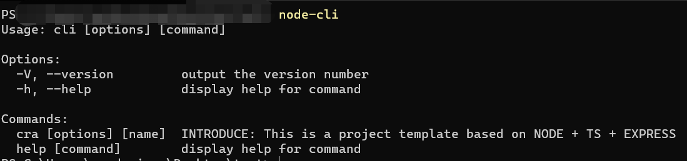
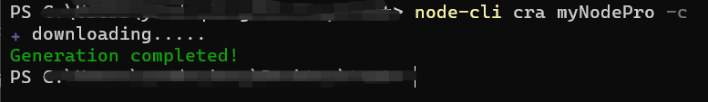
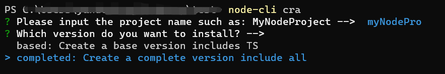
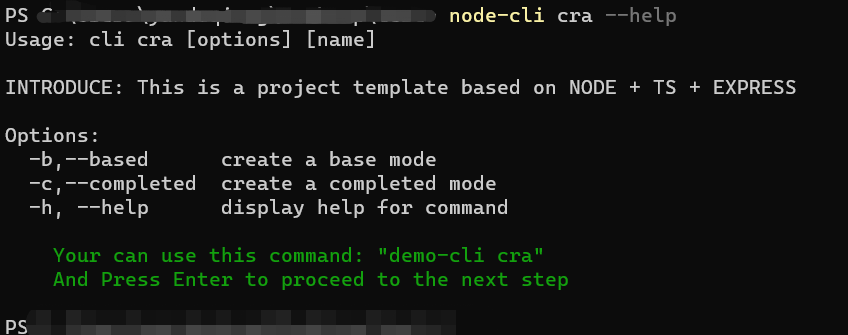

[EN](README.md) / [CN](README_CN.md)

## score-node-cli

> This is the cli to quickly build the infrastructure configuration of a NODE project, building a NODE development environment with EXPRESS + TS. To learn more about the framework, see [github](https://github.com/HardenSG/node-express-ts-template.git)，Hope to get your star

## Usage

> You need to install the cli globally first

```shell
    npm i -g score-node-cli
```

After the global installation, it can be used globally command -> ``node-cli``


You can create a NODE template using ``cra`` in one of two ways

1. Fill in the project name to create directly

```shell
    node-cli cra 'projectName'
```


Of course, you can choose the configuration items：

1. -b -> --based Basic configuration
2. -c -> --completed Completed configuration

```shell
    node-cli cra 'projectName' -c
    node-cli cra 'projectName' --completed
```



1. Select mode to create step by step

```shell
node-cli cra
```



---

For the ``cra`` command you can type``node-cli cra --help``Ask for help


