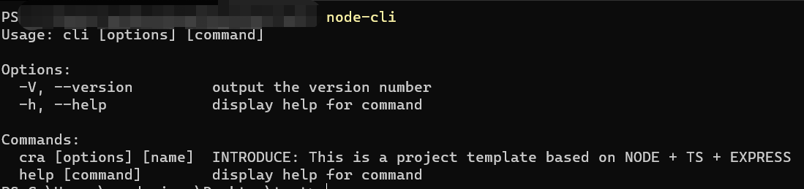
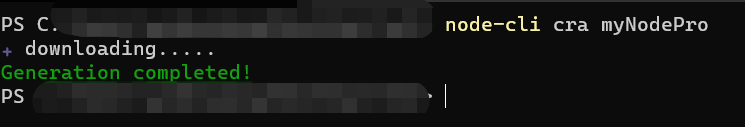
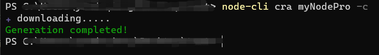
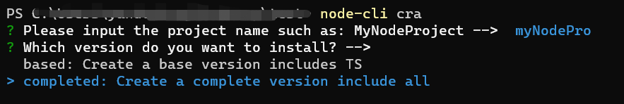
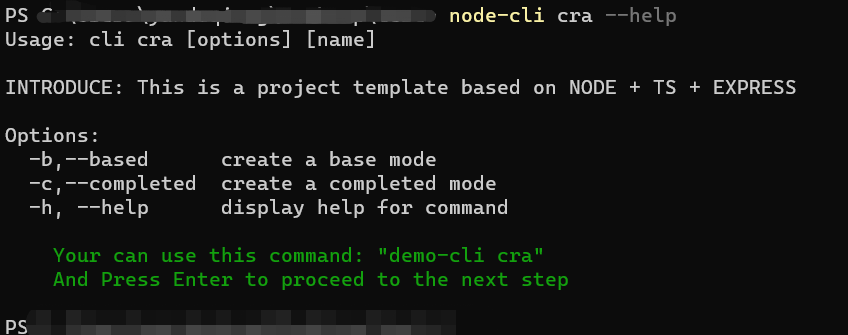

[EN](README.md) / [CN](README_CN.md)

## score-node-cli

> 这是一个快速构建NODE 项目基础化配置的脚手架，构建一个具备EXPRESS + TS 的NODE开发环境，想要了解该框架的具体内容，请查看 [github](https://github.com/HardenSG/node-express-ts-template.git)，希望得到您的star

## Usage

> 你需要先全局安装该脚手架

```shell
    npm i -g score-node-cli
```

全局安装后，可以全局使用 ``node-cli`` 命令


使用cra 命令创建NODE模板，你可以采用两种方式

1. 填写项目名称直接创建

```shell
    node-cli cra 'projectName'
```


当然你可以选择配置项：
      1. -b -> --based 基础配置
      2. -c -> --completed 完善配置

```shell
    node-cli cra 'projectName' -c
    node-cli cra 'projectName' --completed
```



1. 选择模式逐步创建

```shell
node-cli cra
```



---

对于``cra``命令的帮助你可以键入``node-cli cra --help``


